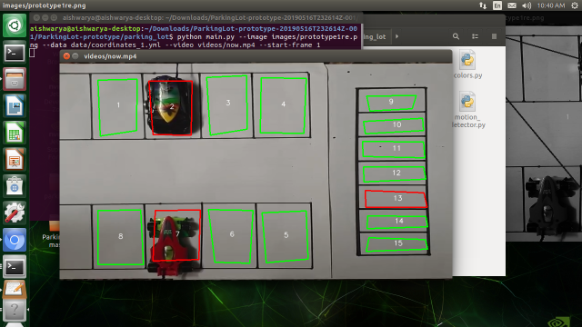

# Parking-Lot-Detection-Using-OpenCV

***********************************************************************************************************************
Requires OpenCV 3.0

Requires python3
**************************************************************************************************************************
To run the project run the following comand

python main.py --image images/prototype1re.png --data data/coordinates_1.yml --video videos/now.mp4 --start-frame 1
************************************************************************************************************************
 Follwoing is the output that we get:
 

